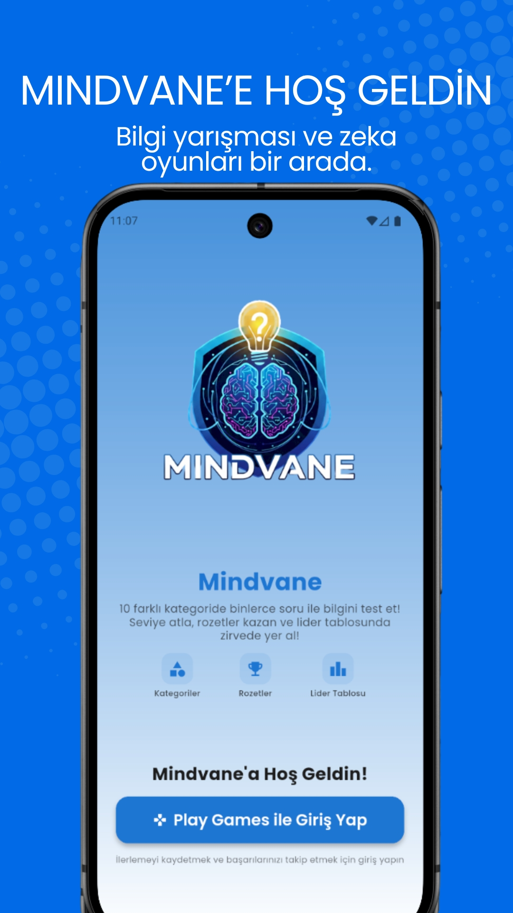
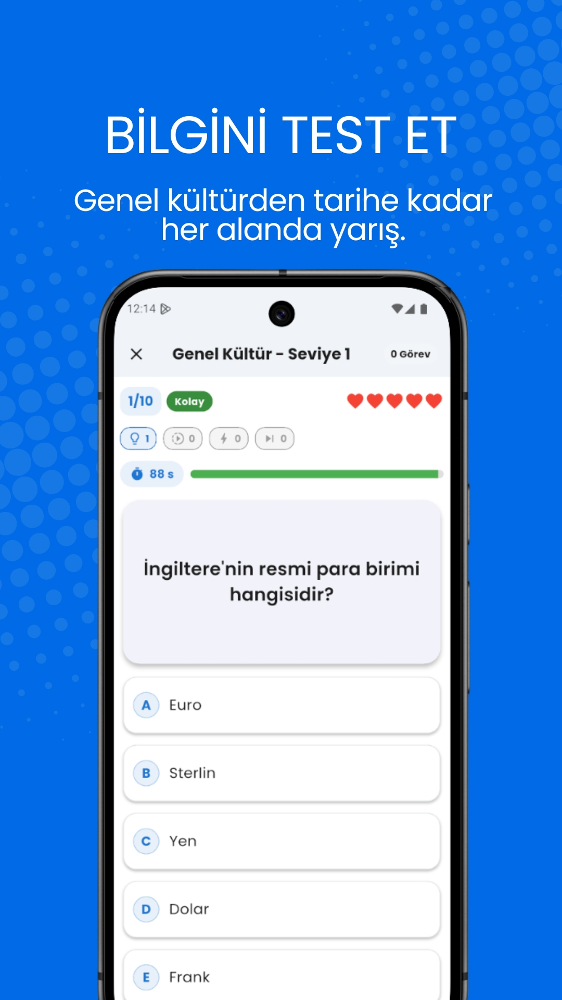
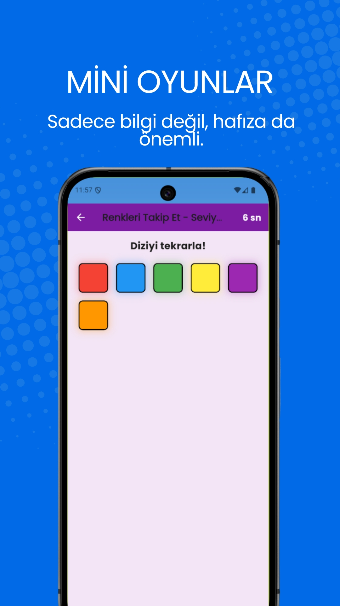
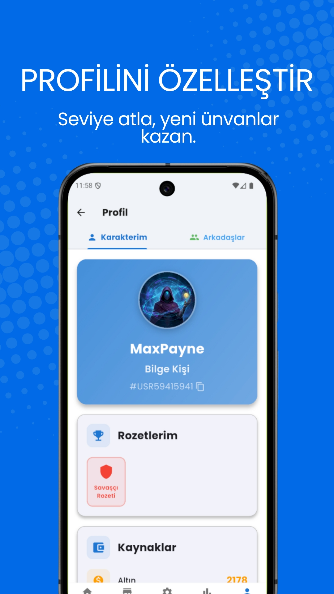
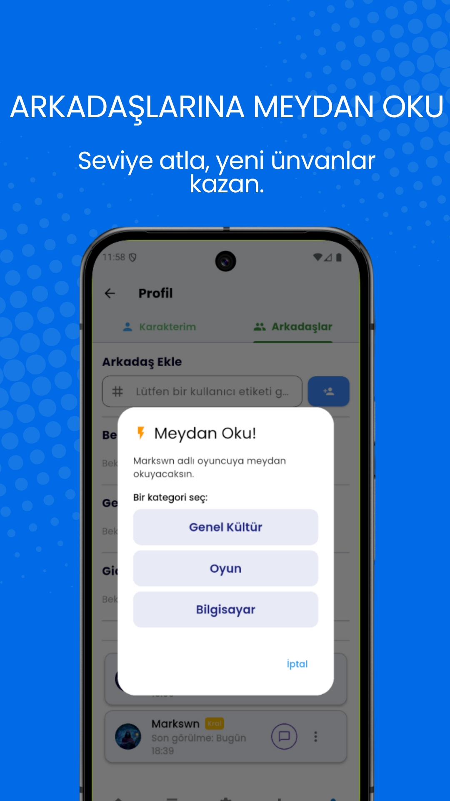
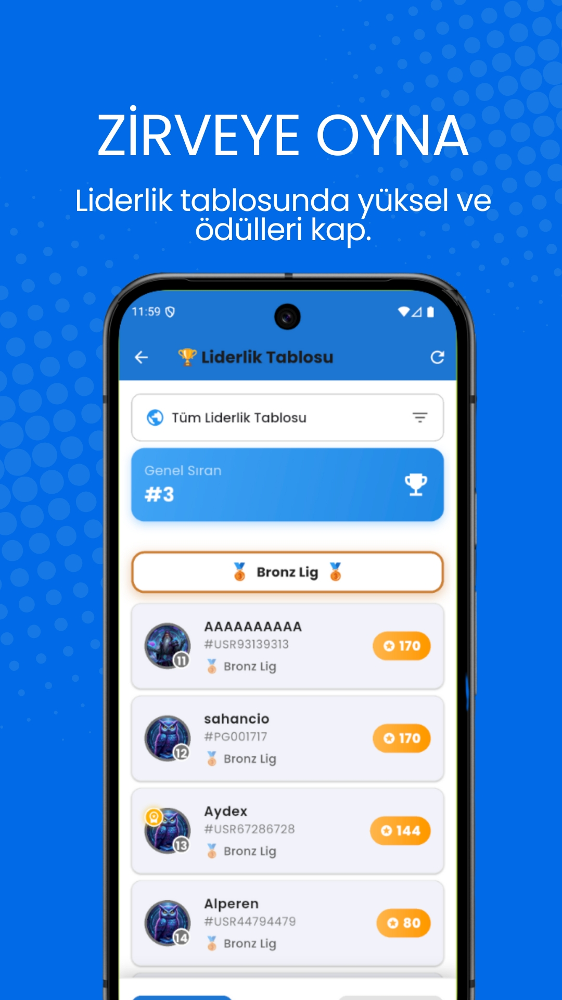

# 🧠 Mindvane: Bilgi Yarışması & Quiz

  
    
  <h1>Mindvane</h1>
  

    <b>🚀 Google Play'de 1.000+ İndirme!</b>
     
    Flutter & Firebase ile Geliştirilmiş, 2026 Model Bilgi Yarışması Deneyimi
  

---

## 📲 Hemen İndir & Oyna

  

---

## 📸 Uygulama İçi Görseller

  
  
  
   
  
  

---

## 💡 Proje Hakkında

**Mindvane**, klasik bilgi yarışmalarını modern bir altyapı ve gelişmiş algoritmalarla birleştiren bir mobil uygulamadır. Kullanıcıların sadece yarışmasını değil, dinamik bir ekosistem içinde sosyalleşmesini hedefler.

Bu proje **uçtan uca (End-to-End)** geliştirilmiş bir üründür. Fikir aşamasından, UI/UX tasarımına, Backend mimarisinden Google Play Store pazarlama stratejilerine kadar tek geliştirici tarafından yönetilmiştir.

---

## 🛠️ Teknik Altyapı & Yetenekler

Bu projede sektör standardı modern teknolojiler ve mimari desenler kullanılmıştır:

* **Frontend:** Flutter (Dart) - *Clean Architecture Prensipleri*
* **Backend:** Firebase (Firestore NoSQL, Authentication, Cloud Functions)
* **State Management:** Provider & Riverpod
* **Monetization (Gelir Modeli):** Google AdMob (Ödüllü Reklamlar, Banner) & RevenueCat (Uygulama İçi Satın Alma)
* **DevOps:** CI/CD süreçleri, Google Play Console Sürüm Yönetimi, Git Sürüm Kontrolü

---

## 🏆 Öne Çıkan Özellikler

* ✅ **Canlı Rekabet:** Gerçek zamanlı güncellenen Global Liderlik Tablosu.
* ✅ **Akıllı Zorluk Algoritması:** Kullanıcının kazanma oranına göre soru zorluğunu (Elo mantığı benzeri) ayarlayan dinamik sistem.
* ✅ **Güvenli Oturum:** Google Sign-In ve E-posta ile güvenli kullanıcı doğrulama.
* ✅ **Oyunlaştırma (Gamification):** Can sistemi, günlük ödüller ve Joker hakları ile yüksek kullanıcı tutma oranı (Retention).

---

## ⚠️ Yasal Uyarı & Lisans

Bu proje ticari bir üründür ve **Kapalı Kaynak (Closed Source)** olarak geliştirilmiştir.
Bu GitHub deposu, projenin teknik kapsamını ve geliştirici yetkinliklerini sergilemek amacıyla **Vitrin (Showcase)** olarak oluşturulmuştur. Kaynak kodları halka açık değildir.

**Copyright © 2026 Eren Akpınar. Tüm Hakları Saklıdır.**
